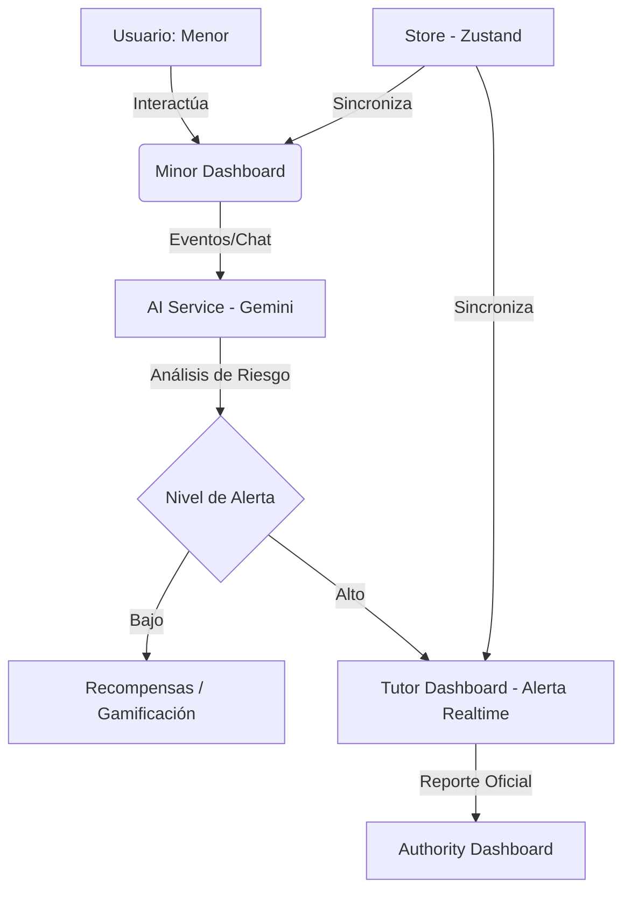

# Guardian - Plataforma de Seguridad Digital para Menores

Guardian es una solución integral diseñada para proteger a los menores en el entorno digital, fomentando hábitos saludables a través de la gamificación y permitiendo una supervisión activa y preventiva por parte de tutores.

## Problema que resuelve

En la actualidad, los menores están expuestos a riesgos crecientes en internet como el grooming, ciberbullying, acceso a contenido inapropiado y adicción al tiempo de pantalla. Guardian resuelve esto creando un puente de confianza entre menores y tutores, transformando la supervisión digital de una tarea restrictiva a una experiencia educativa y gratificante mediante el uso de Inteligencia Artificial preventiva y un sistema de recompensas.

## Tecnologías y herramientas utilizadas

- **Frontend:** React 19, TypeScript, Vite.
- **Estilos:** Tailwind CSS v4.
- **Animaciones:** Framer Motion.
- **Iconografía:** Lucide React.
- **Estado Global:** Zustand.
- **Efectos:** Canvas Confetti.
- **IA (Core):** Google Generative AI (@google/genai).

## Transparencia en el uso de Inteligencia Artificial

Siguiendo las normas del **Hackathon 404: Threat Not Found**, documentamos el uso de herramientas de IA durante el proceso:

1.  **En la solución (Producto):**
    - **Google Gemini AI (Modelo Flash/Pro):** Integrado en el servicio `aiService.ts` para el análisis semántico de riesgos en tiempo real (detección de grooming, toxicidad y estafas).
2.  **En el desarrollo (Productividad):**
    - **Claude Code & Gemini:** Utilizados para la generación de la estructura lógica, componentes de React y funciones de manejo de estado.
    - **Google AI Studio:** Utilizado para el prototipado rápido de prompts y el diseño conceptual de la interfaz de usuario.
    - **Medida:** La lógica de negocio, la arquitectura del estado global con Zustand y la integración de servicios fueron supervisadas y ensambladas por el equipo para garantizar la viabilidad técnica y originalidad.

## Desarrollo y Originalidad

- **Inicio del Proyecto:** El desarrollo comenzó desde cero el primer día del hackathon (24 de abril de 2026).
- **Repositorio:** El trabajo se realizó inicialmente en un repositorio privado de desarrollo y fue migrado a este repositorio oficial para la entrega final. Todo el historial de avance refleja el trabajo intensivo durante el desarrollo del proyecto.
- **Diseño:** El diseño visual fue asistido por Google AI Studio, priorizando una interfaz limpia y funcional para usuarios menores y tutores.

## Arquitectura del Sistema



## Instrucciones para ejecutar el prototipo

1.  **Instalar dependencias:**
    ```bash
    npm install
    ```
2.  **Configurar variables de entorno:**
    Crea un archivo `.env` basado en `.env.example` y añade tu `GEMINI_API_KEY`.
3.  **Iniciar el servidor de desarrollo:**
    ```bash
    npm run dev
    ```
4.  **Acceder a la aplicación:**
    Abre `http://localhost:3000` en tu navegador.

## Entregables Multimedia

- **Demo en vivo:** [https://demo-pied-nu-45.vercel.app/]
- **Video Demo (2 min):** *[Insertar link de YouTube/Drive aquí]*
- **Materiales de Diseño:** El diseño fue iterado directamente en el prototipo usando Google AI Studio para agilizar la implementación funcional.

## Roadmap / Evolución Planeada

Para la implementación real con el capital semilla, el equipo ha definido los siguientes pasos estratégicos:

1.  **Infraestructura de Grado Empresarial:** Migración a **Google Cloud Platform (GCP) o AWS** para asegurar una infraestructura elástica, capaz de procesar millones de interacciones con latencia mínima.
2.  **Seguridad Avanzada de Datos:** 
    - Implementación de **encriptación robusta para datos en reposo y en tránsito**, garantizando que la información sensible de los menores esté protegida contra accesos no autorizados o hackeos.
    - Protocolos estrictos de anonimización para el entrenamiento de modelos de IA.
3.  **Transición a Ecosistema Nativo:** Evolución de la actual PWA hacia aplicaciones nativas para **iOS y Android**, permitiendo un control perimetral más efectivo y una mejor experiencia de usuario (UX) mediante diseño optimizado.
4.  **Gamificación y Recompensas:** 
    - Ampliación del catálogo de premios incluyendo **skins exclusivas** para juegos populares (Roblox, Fortnite, Minecraft) y **cupones de descuento** en plataformas educativas y de entretenimiento.
5.  **Expansión de Plataformas:**
 Extender la protección de Guardian a ecosistemas adicionales como **YouTube**.
5.  **Integración Avanzada con TikTok:** Desarrollo de herramientas especializadas para el análisis profundo de tendencias y datos de TikTok, permitiendo identificar patrones de contacto sospechosos antes de que escalen.

## Integrantes del equipo (Orden Alfabético)

- Christian Ariel Portillo Mejía
- Diego Damián Canales Zendreros
- Ezequiel Benito Hernández Hernández
- Karla Elena Solorzano López
- Xavier Misael Armenta Muñoz.

---
*Este proyecto es una demostración funcional de una plataforma de seguridad digital avanzada para la Hackathon.*
tal avanzada para la Hackathon.*
