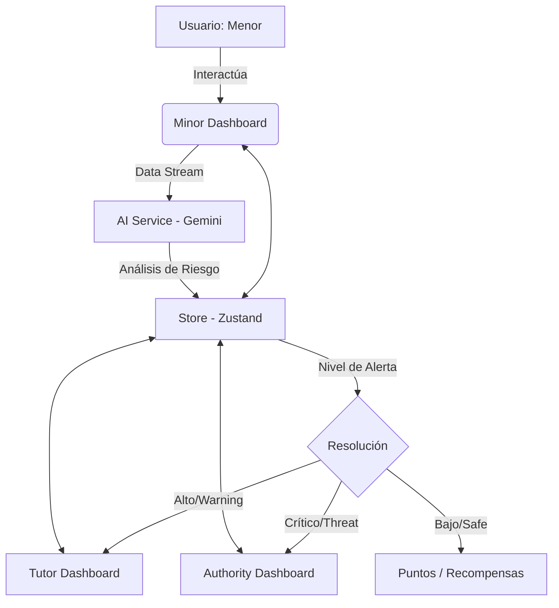

# Guardian - Plataforma de Seguridad Digital para Menores

Guardian es una solución integral diseñada para proteger a los menores en el entorno digital, fomentando hábitos saludables a través de la gamificación y permitiendo una supervisión activa y preventiva por parte de tutores.

## Problema que resuelve

En la actualidad, los menores están expuestos a riesgos crecientes en internet como el grooming, ciberbullying, acceso a contenido inapropiado y adicción al tiempo de pantalla. Guardian resuelve esto creando un puente de confianza entre menores y tutores, transformando la supervisión digital de una tarea restrictiva a una experiencia educativa y gratificante mediante el uso de Inteligencia Artificial preventiva y un sistema de recompensas.

## Tecnologías y herramientas utilizadas

- **Frontend:** React 19, TypeScript, Vite.
- **Estilos:** Tailwind CSS v4.
- **Animaciones:** Framer Motion.
- **Iconografía:** Lucide React.
- **Estado Global:** Zustand.
- **Efectos:** Canvas Confetti.
- **IA (Core):** Google Generative AI (@google/genai).

## Transparencia en el uso de Inteligencia Artificial

Siguiendo las normas del **Hackathon 404: Threat Not Found**, documentamos el uso de herramientas de IA durante el proceso:

1.  **En la solución (Producto):**
    El proyecto Guardian es una plataforma de seguridad infantil que utiliza una arquitectura de microservicios de IA para detectar contenido peligroso en tiempo real. Utiliza un enfoque híbrido que combina modelos de lenguaje (LLMs), visión artificial (Computer Vision) y reglas de contexto.

    **Desglose de modelos y funciones:**
    - **Clasificación de Texto (Zero-Shot):** `facebook/bart-large-mnli`. Analiza mensajes para identificar riesgos como contenido sexual, toxicidad, grooming o reclutamiento.
    - **Análisis Semántico:** `paraphrase-multilingual-MiniLM-L12-v2`. Detecta patrones de acoso comparando significados semánticos y jerga con bases de datos de frases peligrosas.
    - **Detección de Objetos:** `MobileNetV2` (ImageNet). Escanea imágenes en busca de armas o parafernalia de drogas.
    - **Clasificación NSFW:** `Falconsai/nsfw_image_detection` (Vision Transformer). Filtro especializado para bloquear contenido sexualmente explícito.
    - **Reconocimiento Óptico (OCR):** `EasyOCR`. Extrae texto de memes, capturas o stickers para su posterior análisis con los modelos de texto.
    - **Motor de Contexto:** Lógica híbrida para desambiguar jerga cultural (ej. narcocultura) y evitar falsos positivos.

    **Flujo de Veredicto (Risk Aggregator):**
    Cuando se procesa contenido, los modelos trabajan en paralelo: EasyOCR extrae texto, BART/MiniLM analizan la semántica, y MobileNetV2/NSFW ViT evalúan la imagen. El agregador consolida los resultados para emitir un veredicto: **SAFE**, **WARNING** o **BLOCKED**.
2.  **En el desarrollo (Productividad):**
    - **Claude Code & Gemini:** Utilizados para la generación de la estructura lógica, componentes de React y funciones de manejo de estado.
    - **Google AI Studio:** Utilizado para el prototipado rápido de prompts y el diseño conceptual de la interfaz de usuario.
    - **Medida:** La lógica de negocio, la arquitectura del estado global con Zustand y la integración de servicios fueron supervisadas y ensambladas por el equipo para garantizar la viabilidad técnica y originalidad.

## Desarrollo y Originalidad

- **Inicio del Proyecto:** El desarrollo comenzó desde cero el primer día del hackathon (24 de abril de 2026).
- **Repositorio:** El trabajo se realizó inicialmente en un repositorio privado de desarrollo y fue migrado a este repositorio oficial para la entrega final. Todo el historial de avance refleja el trabajo intensivo durante el desarrollo del proyecto.
- **Diseño:** El diseño visual fue asistido por Google AI Studio, priorizando una interfaz limpia y funcional para usuarios menores y tutores.

## Arquitectura del Sistema



## Roles de Usuario

### Menor (Minor)
- **Dashboard Gamificado:** Visualización de puntos, rachas de uso responsable y niveles.
- **Entorno Seguro:** Acceso a aplicaciones verificadas y seguras.
- **Historial de Uso:** Transparencia sobre el tiempo dedicado a cada aplicación.
- **Sistema de Premios:** Canje de puntos obtenidos por beneficios acordados con el tutor.
- **Educación:** Sección dedicada al aprendizaje sobre seguridad digital.

### Tutor (Guardian)
- **Panel de Supervisión:** Monitoreo en tiempo real de la actividad y tiempo de pantalla.
- **Alertas Críticas:** Notificaciones instantáneas sobre riesgos detectados por IA (grooming, contenido violento, estafas, etc.).
- **Gestión de Premios:** Creación y activación de recompensas personalizadas.
- **Vinculación Segura:** Emparejamiento rápido con dispositivos de menores mediante código QR.
- **Configuración de Límites:** Establecimiento de horarios y restricciones de uso.

### Autoridad (Authority)
- **Panel Institucional:** Diseñado para supervisión de alto nivel o reportes institucionales (disponible en modo demo).

## Instrucciones para ejecutar el prototipo

1.  **Instalar dependencias:**
    ```bash
    npm install
    ```
2.  **Configurar variables de entorno:**
    Crea un archivo `.env` basado en `.env.example` para desarrollo local, o define las mismas variables en Vercel. Usa `VITE_GEMINI_API_KEY` y `VITE_MAPBOX_TOKEN`.
3.  **Iniciar el servidor de desarrollo:**
    ```bash
    npm run dev
    ```
4.  **Acceder a la aplicación:**
    Abre `http://localhost:3000` en tu navegador.

## Entregables Multimedia

- **Demo en vivo:** [https://demo-pied-nu-45.vercel.app/]
- **Video Demo (2 min):** *[Insertar link de YouTube/Drive aquí]*
- **Materiales de Diseño:** El diseño fue iterado directamente en el prototipo usando Google AI Studio para agilizar la implementación funcional.

## Roadmap / Evolución Planeada

Para la implementación real con el capital semilla, el equipo ha definido los siguientes pasos estratégicos:

1.  **Infraestructura de Grado Empresarial:** Migración a **Google Cloud Platform (GCP) o AWS** para asegurar una infraestructura elástica, capaz de procesar millones de interacciones con latencia mínima.
2.  **Seguridad Avanzada de Datos:** 
    - Implementación de **encriptación robusta para datos en reposo y en tránsito**, garantizando que la información sensible de los menores esté protegida contra accesos no autorizados o hackeos.
    - Protocolos estrictos de anonimización para el entrenamiento de modelos de IA.
3.  **Transición a Ecosistema Nativo:** Evolución de la actual PWA hacia aplicaciones nativas para **iOS y Android**, permitiendo un control perimetral más efectivo y una mejor experiencia de usuario (UX) mediante diseño optimizado.
4.  **Gamificación y Recompensas:** 
    - Ampliación del catálogo de premios incluyendo **skins exclusivas** para juegos populares (Roblox, Fortnite, Minecraft) y **cupones de descuento** en plataformas educativas y de entretenimiento.
5.  **Expansión de Plataformas:**
 Extender la protección de Guardian a ecosistemas adicionales como **YouTube**.
6.  **Integración Avanzada con TikTok:** Desarrollo de herramientas especializadas para el análisis profundo de tendencias y datos de TikTok, permitiendo identificar patrones de contacto sospechosos antes de que escalen.

## Integrantes del equipo (Orden Alfabético)

- Christian Ariel Portillo Mejía
- Diego Damián Canales Zendreros
- Ezequiel Benito Hernández Hernández
- Karla Elena Solorzano López
- Xavier Misael Armenta Muñoz.

---
*Este proyecto es una demostración funcional de una plataforma de seguridad digital avanzada para la Hackathon.*
tal avanzada para la Hackathon.*
